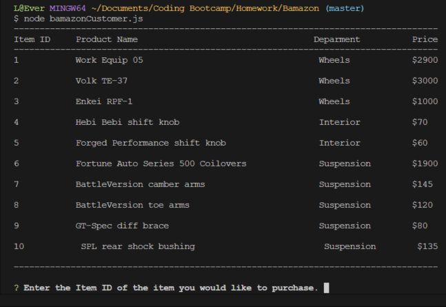

# Bamazon
Bamazon is an Amazon like command-line interfaces for customers.

## Technologies Used
- [x] ES7, Node, MySQL

## How to Run
To run Bamazon you will need [Bash](https://git-scm.com/downloads/), [Node](https://nodejs.org/en/), [npm](https://www.npmjs.com/get-npm?utm_source=house&utm_medium=homepage&utm_campaign=free%20orgs&utm_term=Install%20npm), and [MySQL Workbench](https://dev.mysql.com/downloads/workbench/).

1. In Bash, to clone the repo type `git clone repo-link-here` to download Bamazon.

2. Then, type `cd directory-of-bamazon-foleder; npm install` to download the required packages.

3. In MySQL Workbench, connect to `localhost:3306` and run `bamazon_schema.sql` then `bamazon_seeds.sql`.

4. In Bash, type `node bamazonCustomer.js` to log in as a customer.

## Demos - Customer

As a customer, you can check for products that are for sale and buy them.

To buy an item, enter the item ID and quantity. 

If an item is out of stock or the quanitty isnt enough, customer is prompted to reorder

The total is calculated based on quantity once an order goes through.

